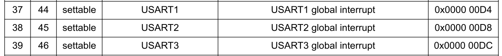

# NUCLEO-F446RE

https://www.st.com/en/evaluation-tools/nucleo-f446re.html

stm32cubeIDE:

https://www.st.com/en/development-tools/stm32cubeide.html

## packages

```shell
sudo dnf install stlink
```

st-info

```shell
[fahmad@ryzen ~]$  st-info --probe
Found 1 stlink programmers
  version:    V2J33S25
  serial:     066AFF505282494867173940
  flash:      524288 (pagesize: 131072)
  sram:       131072
  chipid:     0x0421
  descr:      F446
```

## constraint characters and constrain modifier


### implementation

`r3` has value `0x32`


now `r0` has value `0x32`


## X3 (crystal oscillator) is missing

in `um1724-stm32-nucleo64-boards-mb1136-stmicroelectronics.pdf`


## bit band

see `Cortex-M4-devices-generic-user-guide.pdf` page 25.

## naked function

```shell
__attribute__((naked)) function attribute
This attribute tells the compiler that the function is an embedded assembly function.
```

https://developer.arm.com/documentation/100067/0612/Compiler-specific-Function--Variable--and-Type-Attributes/--attribute----naked---function-attribute

example

```c
__attribute__((naked)) int add(int i, int j); /* Declaring a function with __attribute__((naked)). */

__attribute__((naked)) int add(int i, int j)
{
    __asm("ADD r0, r1, #1"); /* Basic assembler statements are supported. */

/*  Parameter references are not supported inside naked functions: */
//  __asm (
//    "ADD r0, %[input_i], %[input_j]"       /* Assembler statement with parameter references */
//    :                                      /* Output operand parameter */
//    : [input_i] "r" (i), [input_j] "r" (j) /* Input operand parameter */
//    );


/*  Mixing C code is not supported inside naked functions: */
/*  int res = 0;
    return res;
*/

}

```

## AAPCS standard

go to https://github.com/ARM-software/abi-aa/releases , choose `aapcs32.pdf`.


check `cortexM4/007Stack/Debug/007Stack.list`

## Steps to program an MCU peripheral interrupt

- Identify the IRQ number of the peripheral by referring to the MCU vector table. IRQ numbers are vendor-specific

- Program the Processor register to enable that IRQ (only when you enable the IRQ, the processor will accept the interrupt over that line ).Set the priority (optional)

- Configure the peripheral (USART3) using its peripheral configuration register. For example, in the case of USART3, whenever a packet is received, it will automatically issue an interrupt on the IRQ line 39.

- When the interrupt is issued on the IRQ line, it will first get pended in the pending register of the processor.

- NVIC will allow the IRQ handler associated with the IRQ number to run only if the priority of the new interrupts higher than the currently executing interrupt handler. Otherwise newly arrived interrupt will stay in pending state.

- Please note that if peripheral issues an interrupt when the IRQ number is disabled (not activated from the processor side), then still interrupt will get pended in the pending register of the NVIC. As soon as IRQ is enabled, it will trigger the execution of the ISR if the priority is higher than the currently active ISR.

## 008USART3_int_pend

see `rm0390-stm32f446xx-advanced-armbased-32bit-mcus-stmicroelectronics.pdf` page 241. USART3 is in position 39



**why we use ISPR1 ?** \
Interrupt Set-pending Registers contains NVIC_ISPR0-NVIC_ISPR7 registers. Each register can handle 32 IRQs. Since the IRQ is 39 (USART3), we have to use ISPR1.

# References

- Test-Driven Development for Embedded C (https://pragprog.com/titles/jgade/test-driven-development-for-embedded-c/)
- https://developer.arm.com/Processors/Cortex-M4
- https://electronics.stackexchange.com/questions/622968/some-questions-about-crystal-oscillators-of-an-stm32-microcontroller-board
- https://www.st.com/content/st_com/en/stm32-mcu-developer-zone.html

## videos

- https://www.youtube.com/watch?v=pHyz2-wbDw4
- https://www.youtube.com/watch?v=hyZS2p1tW-g

## other github

- https://github.com/prtzl/Embedded_videos
- https://github.com/davisjp1822/stm32_nucleo_linux

## stm32cube

- https://www.st.com/en/embedded-software/stm32cube-mcu-mpu-packages.html#tools-software

## books and resources

- https://github.com/cnoviello/mastering-stm32-2nd
- https://leanpub.com/mastering-stm32-2nd
- https://www.amazon.com/Joseph-Yiu/e/B001IQWINC/ref=sr_ntt_srch_lnk_2?qid=1443620939&sr=8-2-fkmr0
