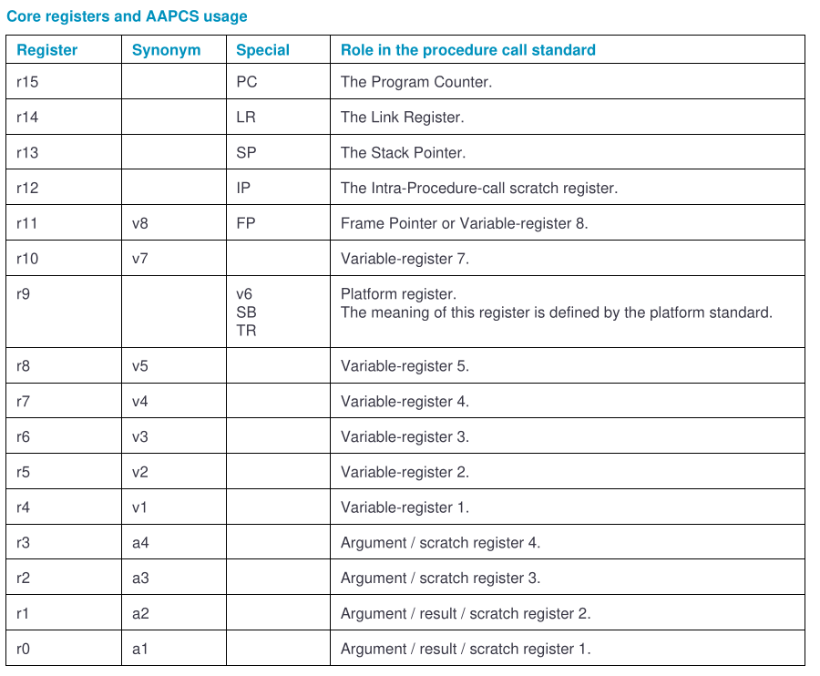

# NUCLEO-F446RE

https://www.st.com/en/evaluation-tools/nucleo-f446re.html

stm32cubeIDE:

https://www.st.com/en/development-tools/stm32cubeide.html

## packages

```shell
sudo dnf install stlink
```

st-info

```shell
[fahmad@ryzen ~]$  st-info --probe
Found 1 stlink programmers
  version:    V2J33S25
  serial:     066AFF505282494867173940
  flash:      524288 (pagesize: 131072)
  sram:       131072
  chipid:     0x0421
  descr:      F446
```

## constraint characters and constrain modifier


### implementation

`r3` has value `0x32`


now `r0` has value `0x32`


## X3 (crystal oscillator) is missing

in `um1724-stm32-nucleo64-boards-mb1136-stmicroelectronics.pdf`


## bit band

see `Cortex-M4-devices-generic-user-guide.pdf` page 25.

## naked function

```shell
__attribute__((naked)) function attribute
This attribute tells the compiler that the function is an embedded assembly function.
```

https://developer.arm.com/documentation/100067/0612/Compiler-specific-Function--Variable--and-Type-Attributes/--attribute----naked---function-attribute

## AAPCS standard

go to https://github.com/ARM-software/abi-aa/releases , choose `aapcs32.pdf`.



check `cortexM4/007Stack/Debug/007Stack.list`

# References

- Test-Driven Development for Embedded C (https://pragprog.com/titles/jgade/test-driven-development-for-embedded-c/)
- https://developer.arm.com/Processors/Cortex-M4 (Cortex-M4)
- https://electronics.stackexchange.com/questions/622968/some-questions-about-crystal-oscillators-of-an-stm32-microcontroller-board

## videos

- https://www.youtube.com/watch?v=pHyz2-wbDw4
- https://www.youtube.com/watch?v=hyZS2p1tW-g

## other github

- https://github.com/prtzl/Embedded_videos
- https://github.com/davisjp1822/stm32_nucleo_linux

## stm32cube

- https://www.st.com/en/embedded-software/stm32cube-mcu-mpu-packages.html#tools-software
