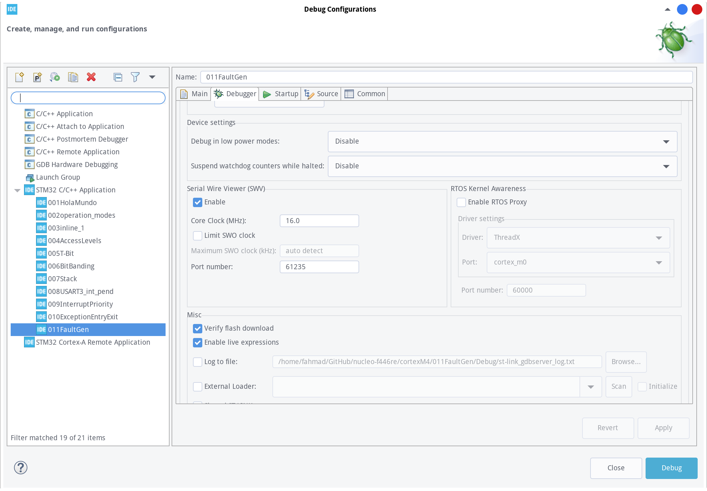
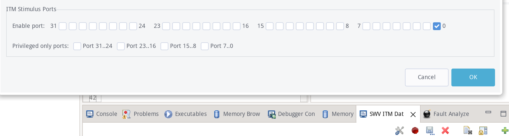
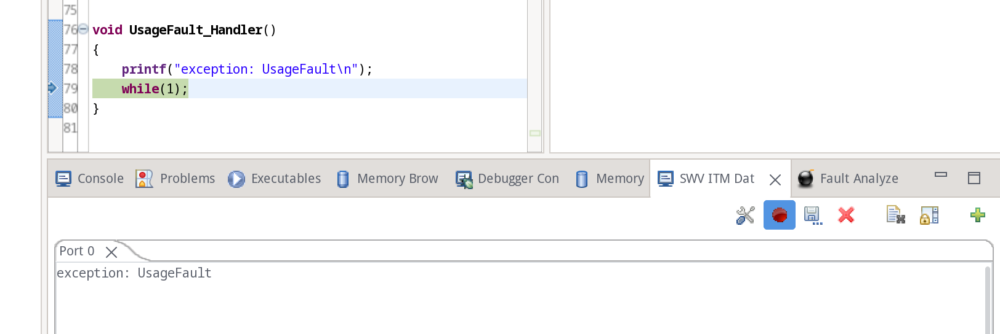
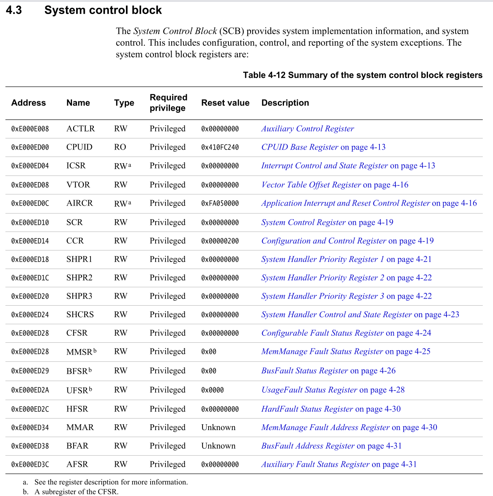
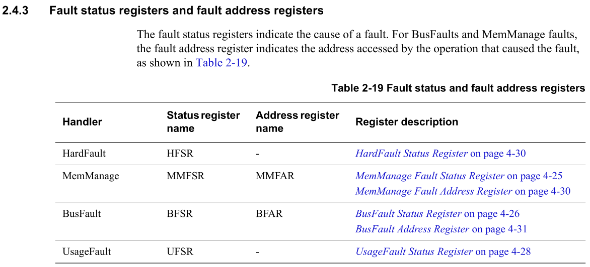
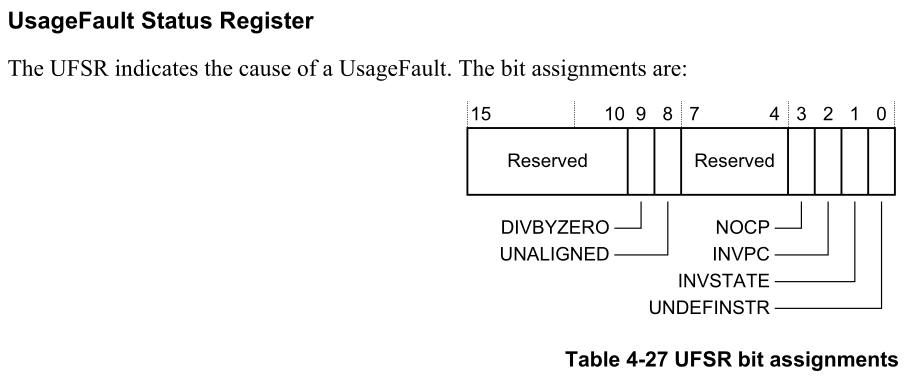
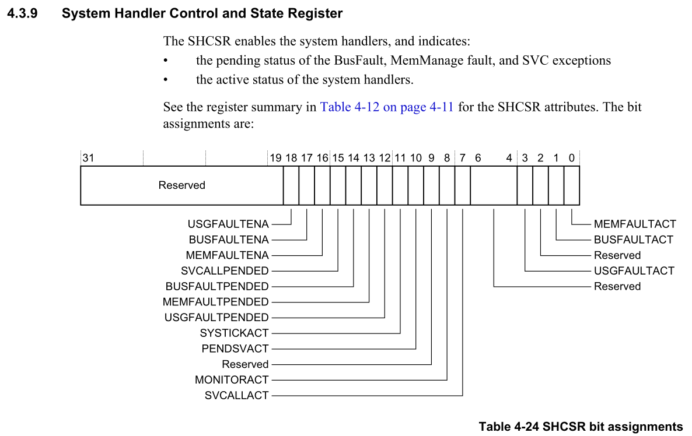
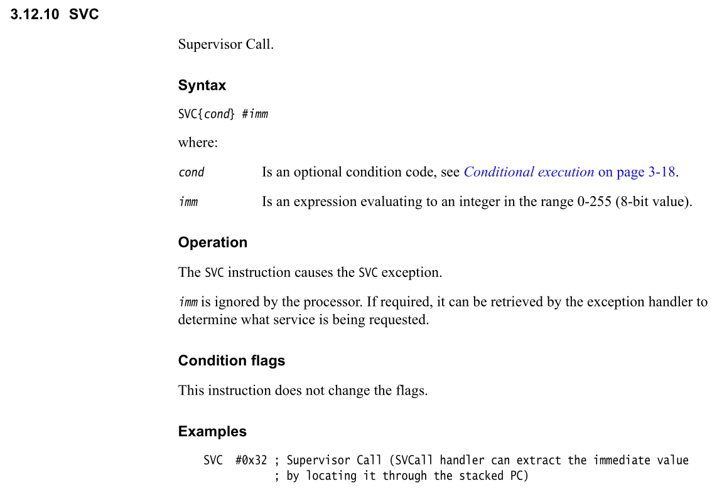
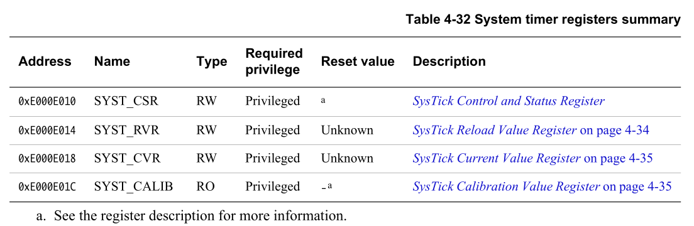

# printf

copy the following to `syscalls.c`

```c
/////////////////////////////////////////////////////////////////////////////////////////////////////////
//           Implementation of printf like feature using ARM Cortex M3/M4/ ITM functionality
//           This function will not work for ARM Cortex M0/M0+
//           If you are using Cortex M0, then you can use semihosting feature of openOCD
/////////////////////////////////////////////////////////////////////////////////////////////////////////


//Debug Exception and Monitor Control Register base address
#define DEMCR                   *((volatile uint32_t*) 0xE000EDFCU )

/* ITM register addresses */
#define ITM_STIMULUS_PORT0   	*((volatile uint32_t*) 0xE0000000 )
#define ITM_TRACE_EN          	*((volatile uint32_t*) 0xE0000E00 )

void ITM_SendChar(uint8_t ch)
{

	//Enable TRCENA
	DEMCR |= ( 1 << 24);

	//enable stimulus port 0
	ITM_TRACE_EN |= ( 1 << 0);

	// read FIFO status in bit [0]:
	while(!(ITM_STIMULUS_PORT0 & 1));

	//Write to ITM stimulus port0
	ITM_STIMULUS_PORT0 = ch;
}
```

and inside the `_write` function inside `syscalls.c`, replace `__io_putchar` with `ITM_SendChar`

```c
__attribute__((weak)) int _write(int file, char *ptr, int len)
{
	int DataIdx;

	for (DataIdx = 0; DataIdx < len; DataIdx++)
	{
//		__io_putchar(*ptr++);
		ITM_SendChar(*ptr++);
	}
	return len;
}
```

in debug configuration, enable SWV



make sure the least significant bit is set to one (SWV setting during debugging)



result



# Fault handling

## system control block



you'll get the address of SHCSR `0xE000ED24` and you put it inside code like the following:

```shell
uint32_t *pSHCSR = (uint32_t*)0xE000ED24;
```

## fault status registers

when a fault happens, inside the fault handler, you can check a couple of fault status and address information registers to get more details about the fault and the instruction address at which the fault happened.



example usageFault --> register address (UFSR) is 0xE000ED2A

```c
uint32_t *pUFSR = (uint32_t*)0xE000ED2A;
printf("exception: UsageFault\n");
printf("USFR = %lx\n", (*pUFSR) & 0xFFFF);
```

the meaning of USFR



## System Handler Control and State Register



# SVC exception



## SVCMath

remember to which register we store argument/result


# PendSV exception

# implementation of task scheduler

## configure systick timer

- Internal 16 MHz factory-trimmed RC (1% accuracy)
- 1x SysTick timer and up to twelve 16-bit and two 32-bit timers up to 180 MHz,
- 1m is 1KHz in frequency domain = (we want 1000 sys tick exceptions in 1 sec)
- to bring down systick timer count clock from 16MHz to 1KHz use a divisor (reload value)
- reload value = 16000

16000000 Hz / 16000 count value = 1000 Hz (TICK_HZ - desired exception frequency)



## gpio

```c
#define PERIPH_BASE           0x40000000UL /*!< Peripheral base address in the alias region                                */

#define AHB1PERIPH_BASE       (PERIPH_BASE + 0x00020000UL)

#define GPIOA_BASE            (AHB1PERIPH_BASE + 0x0000UL)
```

AHB1PERIPH_BASE = 0x40020000
GPIOA_BASE = 0x40020000 + 0x0000 = 0x40020000
