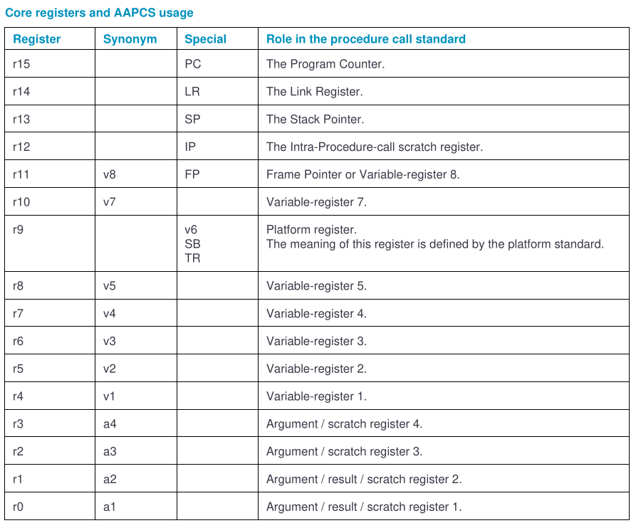
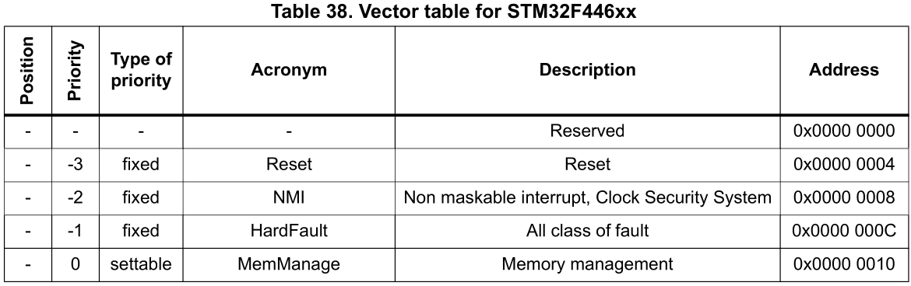

# printf

copy the following to `syscalls.c`

```c
/////////////////////////////////////////////////////////////////////////////////////////////////////////
//           Implementation of printf like feature using ARM Cortex M3/M4/ ITM functionality
//           This function will not work for ARM Cortex M0/M0+
//           If you are using Cortex M0, then you can use semihosting feature of openOCD
/////////////////////////////////////////////////////////////////////////////////////////////////////////


//Debug Exception and Monitor Control Register base address
#define DEMCR                   *((volatile uint32_t*) 0xE000EDFCU )

/* ITM register addresses */
#define ITM_STIMULUS_PORT0   	*((volatile uint32_t*) 0xE0000000 )
#define ITM_TRACE_EN          	*((volatile uint32_t*) 0xE0000E00 )

void ITM_SendChar(uint8_t ch)
{

	//Enable TRCENA
	DEMCR |= ( 1 << 24);

	//enable stimulus port 0
	ITM_TRACE_EN |= ( 1 << 0);

	// read FIFO status in bit [0]:
	while(!(ITM_STIMULUS_PORT0 & 1));

	//Write to ITM stimulus port0
	ITM_STIMULUS_PORT0 = ch;
}
```

and inside the `_write` function inside `syscalls.c`, replace `__io_putchar` with `ITM_SendChar`

```c
__attribute__((weak)) int _write(int file, char *ptr, int len)
{
	int DataIdx;

	for (DataIdx = 0; DataIdx < len; DataIdx++)
	{
//		__io_putchar(*ptr++);
		ITM_SendChar(*ptr++);
	}
	return len;
}
```

in debug configuration, enable SWV


make sure the least significant bit is set to one (SWV setting during debugging)


result


# Fault handling

## system control block


you'll get the address of SHCSR `0xE000ED24` and you put it inside code like the following:

```shell
uint32_t *pSHCSR = (uint32_t*)0xE000ED24;
```

## fault status registers

when a fault happens, inside the fault handler, you can check a couple of fault status and address information registers to get more details about the fault and the instruction address at which the fault happened.


example usageFault --> register address (UFSR) is 0xE000ED2A

```c
uint32_t *pUFSR = (uint32_t*)0xE000ED2A;
printf("exception: UsageFault\n");
printf("USFR = %lx\n", (*pUFSR) & 0xFFFF);
```

the meaning of USFR


## System Handler Control and State Register


# SVC exception


## SVCMath

remember to which register we store argument/result



# PendSV exception

# implementation of task scheduler

## configure systick timer

- Internal 16 MHz factory-trimmed RC (1% accuracy)
- 1x SysTick timer and up to twelve 16-bit and two 32-bit timers up to 180 MHz,
- 1m is 1KHz in frequency domain = (we want 1000 sys tick exceptions in 1 sec)
- to bring down systick timer count clock from 16MHz to 1KHz use a divisor (reload value)
- reload value = 16000

16000000 Hz / 16000 count value = 1000 Hz (TICK_HZ - desired exception frequency)


## gpio

```c
#define PERIPH_BASE           0x40000000UL /*!< Peripheral base address in the alias region                                */

#define AHB1PERIPH_BASE       (PERIPH_BASE + 0x00020000UL)

#define GPIOA_BASE            (AHB1PERIPH_BASE + 0x0000UL)
```

AHB1PERIPH_BASE = 0x40020000
GPIOA_BASE = 0x40020000 + 0x0000 = 0x40020000

# FromScratch

https://developer.arm.com/downloads/-/gnu-rm

https://gcc.gnu.org/onlinedocs/gcc-9.3.0/gcc/

https://gcc.gnu.org/onlinedocs/gcc-9.3.0/gcc/ARM-Options.html#ARM-Options

options: https://gcc.gnu.org/onlinedocs/gcc-9.3.0/gcc/Overall-Options.html#Overall-Options

compiler, link, assembler

```shell
arm-none-eabi-gcc
```

linker

```shell
arm-none-eabi-ld
```

elf file analyzer

```
arm-none-eabi-nm
arm-none-eabi-objdump
arm-none-eabi-readelf
```

assembler

```shell
arm-none-eabi-as
```

format converter

```shell
arm-none-eabi-objcopy
```


source:fastbitlab.com


source:fastbitlab.com

Compile or assemble the source files, but do not link.

```shell
arm-none-eabi-gcc -c -mcpu=cortex-m4 -mthumb main.c -o main.o
```

Stop after the stage of compilation proper; do not assemble.

```shell
arm-none-eabi-gcc -S -mcpu=cortex-m4 -mthumb main.c -o main.s
```

makefile symbols

```
$^ # denotes dependency
$@ # denotes target
```

## Relocatable object files

dump the content of the object file

```shell
arm-none-eabi-objdump -h main.o

main.o:     file format elf32-littlearm

Sections:
Idx Name          Size      VMA       LMA       File off  Algn
  0 .text         00000504  00000000  00000000  00000034  2**2
                  CONTENTS, ALLOC, LOAD, RELOC, READONLY, CODE
  1 .data         00000004  00000000  00000000  00000538  2**2
                  CONTENTS, ALLOC, LOAD, DATA
  2 .bss          00000054  00000000  00000000  0000053c  2**2
                  ALLOC
  3 .rodata       00000064  00000000  00000000  0000053c  2**2
                  CONTENTS, ALLOC, LOAD, READONLY, DATA
  4 .comment      00000024  00000000  00000000  000005a0  2**0
                  CONTENTS, READONLY
  5 .ARM.attributes 0000002e  00000000  00000000  000005c4  2**0
                  CONTENTS, READONLY

```

display assembler contents of executable sections

```shell
arm-none-eabi-objdump -d main.o > main.log
```

display the full contents of all sections requested

```shell
arm-none-eabi-objdump -s main.o
```

```shell
arm-none-eabi-objdump -D main.o > main.log
```

## different data and sections of a program


example

```c
#include <stdint.h>

int g_un_data1;
int g_un_data2 = 0;
int g_i_data = 0x55;//.data
static int g_un_s_data;
static int g_i_s_data = 0x44; //.data

int main(void)
{

}
```

## startup file

STM32F446xx Vector table (see `rm0390-stm32f446xx-advanced-armbased-32bit-mcus-stmicroelectronics.pdf` page 239)

you have to follow the vector table




check `.isr_vector`

```shell
[fahmad@ryzen FromScratch]$  make dump-startup
arm-none-eabi-objdump -h stm32_startup.o

stm32_startup.o:     file format elf32-littlearm

Sections:
Idx Name          Size      VMA       LMA       File off  Algn
  0 .text         0000000c  00000000  00000000  00000034  2**1
                  CONTENTS, ALLOC, LOAD, READONLY, CODE
  1 .data         00000000  00000000  00000000  00000040  2**0
                  CONTENTS, ALLOC, LOAD, DATA
  2 .bss          00000000  00000000  00000000  00000040  2**0
                  ALLOC
  3 .isr_vector   00000008  00000000  00000000  00000040  2**2
                  CONTENTS, ALLOC, LOAD, RELOC, DATA
  4 .comment      00000024  00000000  00000000  00000048  2**0
                  CONTENTS, READONLY
  5 .ARM.attributes 0000002e  00000000  00000000  0000006c  2**0
                  CONTENTS, READONLY

```

## linker script

https://marketplace.visualstudio.com/items?itemName=ZixuanWang.linkerscript

In STM32F446xx, the main system consists of 32-bit multilayer AHB bus matrix that
interconnects:

Seven masters:

- Cortex®-M4 with FPU core I-bus, D-bus and S-bus
- DMA1 memory bus
- DMA2 memory bus
- DMA2 peripheral bus
- USB OTG HS DMA bus

Seven slaves:

- Internal Flash memory ICode bus
- Internal Flash memory DCode bus
- Main internal SRAM1 (112 KB)
- Auxiliary internal SRAM2 (16 KB)
- AHB1 peripherals including AHB to APB bridges and APB peripherals
- AHB2 peripherals
- FMC / QUADSPI

## Problem with OpenOCD and STM32 devices

https://stackoverflow.com/questions/71608471/unable-to-start-debug-session-with-openocd-clion

INSTALLING THE STMicroelectronics version of OpenOCD

```shell
git clone https://github.com/STMicroelectronics/OpenOCD.git
./bootstrap
./configure --enable-stlink
make
sudo make install
```

change dir to FromScratch folder and run using the configuration from the github folder above

```shell
openocd -f /home/fahmad/GitHub/OpenOCD/tcl/board/st_nucleo_f4.cfg
```

## arm-none-eabi-gdb doesn't exist on Fedora

use container (toolbox container) https://containertoolbx.org/install/

```shell
toolbox create -i docker.io/akdev1l/ubuntu-toolbox:22.04
toolbox enter ubuntu-toolbox-22.04
sudo apt install gdb-arm-none-eabi
```

cd to the/dir/nucleo-f446re/cortexM4/FromScratch

```shell
⬢[fahmad@toolbox FromScratch]$ gdb-multiarch
GNU gdb (Ubuntu 12.0.90-0ubuntu1) 12.0.90

(gdb) target remote localhost:3333
Remote debugging using localhost:3333
warning: No executable has been specified and target does not support
determining executable automatically.  Try using the "file" command.
0xfffffffe in ?? ()
(gdb) monitor reset init
Unable to match requested speed 2000 kHz, using 1800 kHz
Unable to match requested speed 2000 kHz, using 1800 kHz
target halted due to debug-request, current mode: Thread
xPSR: 0x01000000 pc: 0xfffffffe msp: 0xfffffffc
Unable to match requested speed 8000 kHz, using 4000 kHz
Unable to match requested speed 8000 kHz, using 4000 kHz
(gdb) monitor flash write_image erase final.elf
auto erase enabled
wrote 16384 bytes from file final.elf in 0.520421s (30.744 KiB/s)

(gdb)

```

more openocd command

```shell
(gdb) target remote localhost:3333
Remote debugging using localhost:3333
warning: No executable has been specified and target does not support
determining executable automatically.  Try using the "file" command.
0x080006c0 in ?? ()
(gdb) monitor reset init
Unable to match requested speed 2000 kHz, using 1800 kHz
Unable to match requested speed 2000 kHz, using 1800 kHz
target halted due to debug-request, current mode: Thread
xPSR: 0x01000000 pc: 0x08000790 msp: 0x20020000
Unable to match requested speed 8000 kHz, using 4000 kHz
Unable to match requested speed 8000 kHz, using 4000 kHz
(gdb) monitor flash write_image erase final.elf
auto erase enabled
wrote 16384 bytes from file final.elf in 0.524344s (30.514 KiB/s)

(gdb) monitor reset
Unable to match requested speed 2000 kHz, using 1800 kHz
Unable to match requested speed 2000 kHz, using 1800 kHz
(gdb) monitor halt
target halted due to debug-request, current mode: Thread
xPSR: 0x01000000 pc: 0x080006c0 psp: 0x2001ebfc
(gdb) monitor mdw 0x0000000020000000 4
0x20000000: 00000000 00001386 2001ebb8 00000000

(gdb) monitor bp 0x00000000080002ec 2hw
Invalid command argument
length option value ('2hw') is not valid
(gdb) monitor bp 0x00000000080002ec 2 hw
breakpoint set at 0x080002ec

(gdb) monitor resume
(gdb) monitor reset
Unable to match requested speed 2000 kHz, using 1800 kHz
Unable to match requested speed 2000 kHz, using 1800 kHz
target halted due to breakpoint, current mode: Thread
xPSR: 0x01000000 pc: 0x080002ec psp: 0x2001ffc0
(gdb) monitor mdw 0x0000000020000000 4
0x20000000: 00000001 00000000 2001ebc0 00000000

(gdb) monitor rbp 0x080002ec
(gdb) monitor bp
(gdb) monitor bp 0x0000000008000310 2 hw
breakpoint set at 0x08000310

(gdb) monitor reset
Unable to match requested speed 2000 kHz, using 1800 kHz
Unable to match requested speed 2000 kHz, using 1800 kHz
target halted due to breakpoint, current mode: Thread
xPSR: 0x01000000 pc: 0x08000310 psp: 0x2001fc00
(gdb) monitor mdw 0x0000000020000000 4
0x20000000: 00000002 00000000 2001ebc0 00000000

(gdb)
```

### gdb multiarch problem on fedora references

- https://www.reddit.com/r/Fedora/comments/x9wlyw/gdbmultiarch_for_cortex_mx/
- https://www.reddit.com/r/arm/comments/rskgrt/help_getting_armnoneeabigdb_to_work_on_fedora_35/
- https://www.mail-archive.com/package-review@lists.fedoraproject.org/msg411106.html
- https://docs.rust-embedded.org/book/intro/install/linux.html
- https://wiki.archlinux.org/title/Toolbox

## using Putty


## telnet command

```shell
[fahmad@ryzen OpenOCD]$  telnet localhost 4444
Trying ::1...
telnet: connect to address ::1: Connection refused
Trying 127.0.0.1...
Connected to localhost.
Escape character is '^]'.
Open On-Chip Debugger
> reset
Unable to match requested speed 2000 kHz, using 1800 kHz
Unable to match requested speed 2000 kHz, using 1800 kHz
target halted due to breakpoint, current mode: Thread
xPSR: 0x01000000 pc: 0x08000310 psp: 0x2001fc00
>
```

to close session:

- type `Ctrl + ]`
- it changes the prompt to `telnet>`
- type `close`

## libc

```shell
[fahmad@ryzen FromScratch]$  telnet localhost 4444
Trying ::1...
telnet: connect to address ::1: Connection refused
Trying 127.0.0.1...
Connected to localhost.
Escape character is '^]'.
Open On-Chip Debugger
> reset init
Unable to match requested speed 2000 kHz, using 1800 kHz
Unable to match requested speed 2000 kHz, using 1800 kHz
target halted due to debug-request, current mode: Thread
xPSR: 0x01000000 pc: 0x080008e4 msp: 0x20020000
Unable to match requested speed 8000 kHz, using 4000 kHz
Unable to match requested speed 8000 kHz, using 4000 kHz
> flash write_image erase final.elf
device id = 0x10006421
flash size = 512 kbytes
auto erase enabled
wrote 16384 bytes from file final.elf in 0.547161s (29.242 KiB/s)

> reset
Unable to match requested speed 2000 kHz, using 1800 kHz
Unable to match requested speed 2000 kHz, using 1800 kHz
> halt
target halted due to debug-request, current mode: Thread
xPSR: 0x01000000 pc: 0x08000814 psp: 0x2001ebfc
>
```

## semi-hosting

telnet part

```shell
[fahmad@ryzen FromScratch]$  telnet localhost 4444
Trying ::1...
telnet: connect to address ::1: Connection refused
Trying 127.0.0.1...
Connected to localhost.
Escape character is '^]'.
Open On-Chip Debugger
> reset init
Unable to match requested speed 2000 kHz, using 1800 kHz
Unable to match requested speed 2000 kHz, using 1800 kHz
target halted due to debug-request, current mode: Thread
xPSR: 0x01000000 pc: 0x080008e4 msp: 0x20020000
Unable to match requested speed 8000 kHz, using 4000 kHz
Unable to match requested speed 8000 kHz, using 4000 kHz
> flash write_image erase final_sh.elf
device id = 0x10006421
flash size = 512 kbytes
auto erase enabled
wrote 32768 bytes from file final_sh.elf in 0.968193s (33.051 KiB/s)

> arm semihosting enable
semihosting is enabled

> reset
Unable to match requested speed 2000 kHz, using 1800 kHz
Unable to match requested speed 2000 kHz, using 1800 kHz
> halt
target halted due to debug-request, current mode: Thread
xPSR: 0x01000000 pc: 0x080007a0 psp: 0x2001ebfc, semihosting
> shutdown
shutdown command invoked
Connection closed by foreign host.
```

openocd part (truncated)

```shell
[fahmad@ryzen FromScratch]$  make flash
openocd -f /home/fahmad/GitHub/OpenOCD/tcl/board/st_nucleo_f4.cfg
Open On-Chip Debugger 0.11.0+dev-00454-gd3b71197b (2022-11-06-23:32) [https://github.com/STMicroelectronics/OpenOCD]
Licensed under GNU GPL v2
For bug reports, read
	http://openocd.org/doc/doxygen/bugs.html
Info : The selected transport took over low-level target control. The results might differ compared to plain JTAG/SWD
srst_only separate srst_nogate srst_open_drain connect_deassert_srst

Info : Listening on port 6666 for tcl connections
Info : Listening on port 4444 for telnet connections
Info : clock speed 2000 kHz
Info : STLINK V2J40M27 (API v2) VID:PID 0483:374B
Info : Target voltage: 3.259960
Info : stm32f4x.cpu: Cortex-M4 r0p1 processor detected
Info : stm32f4x.cpu: target has 6 breakpoints, 4 watchpoints
Info : starting gdb server for stm32f4x.cpu on 3333
Info : Listening on port 3333 for gdb connections
Info : accepting 'telnet' connection on tcp/4444
Info : Unable to match requested speed 2000 kHz, using 1800 kHz
Info : Unable to match requested speed 2000 kHz, using 1800 kHz
target halted due to debug-request, current mode: Thread
xPSR: 0x01000000 pc: 0x080008e4 msp: 0x20020000
Info : Unable to match requested speed 8000 kHz, using 4000 kHz
Info : Unable to match requested speed 8000 kHz, using 4000 kHz
Info : device id = 0x10006421
Info : flash size = 512 kbytes
Info : Unable to match requested speed 2000 kHz, using 1800 kHz
Info : Unable to match requested speed 2000 kHz, using 1800 kHz
simple task scheduler
task1
task2
task3
task4
task4
task3
task4
task4
task2
task3
task4
task4
task3
task4
task4

target halted due to debug-request, current mode: Thread
xPSR: 0x01000000 pc: 0x080007a0 psp: 0x2001ebfc, semihosting
shutdown command invoked
Info : dropped 'telnet' connection

```
