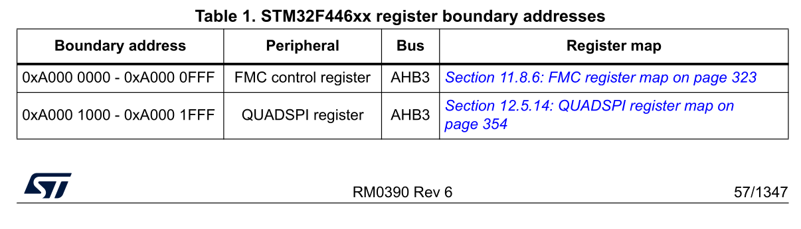
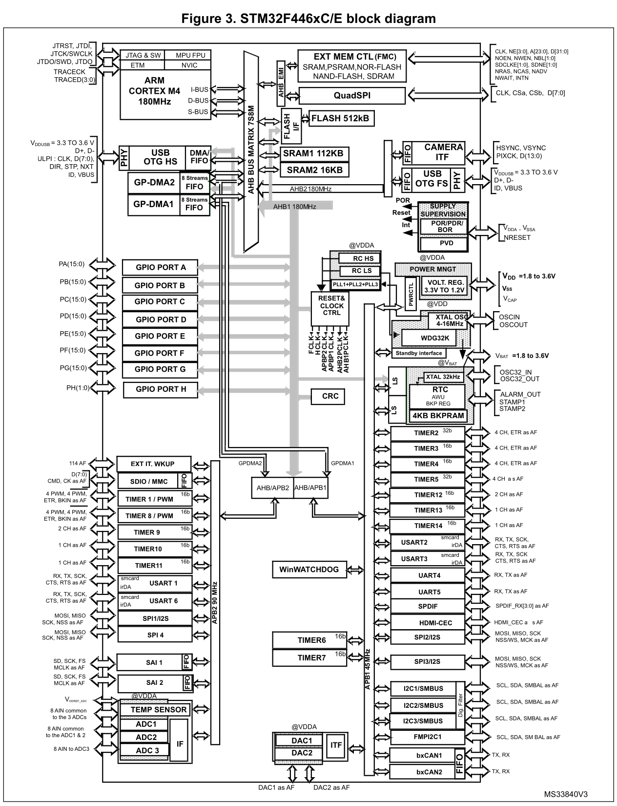
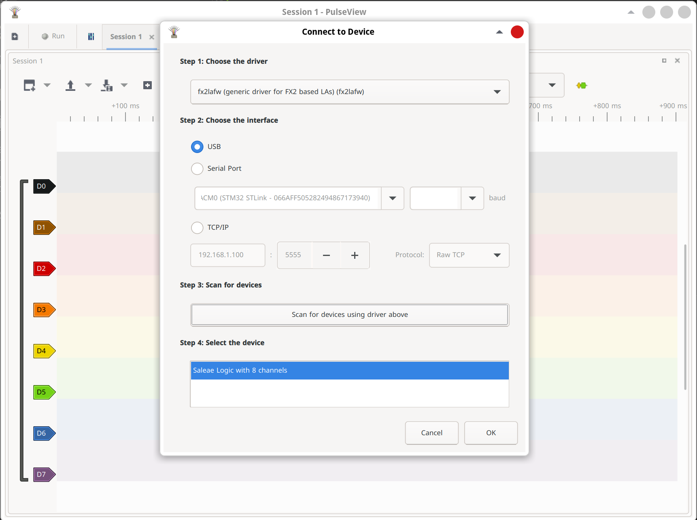
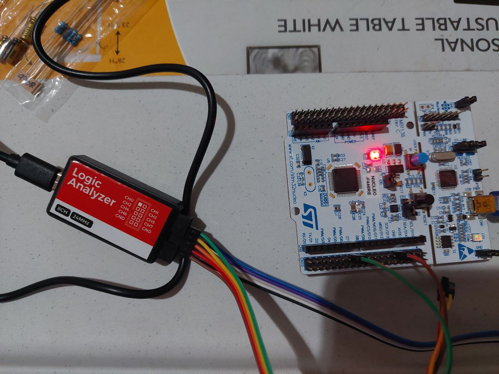
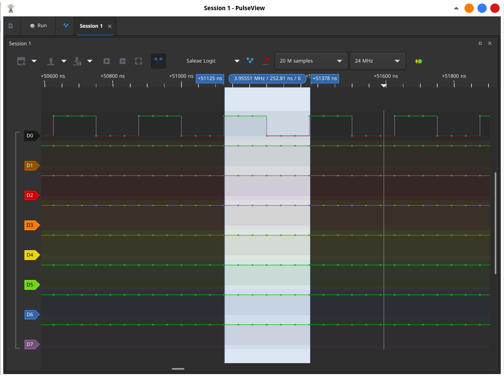

# Mastering MCU

# components

https://www.eevblog.com/forum/beginners/which-logic-analyzer-for-beginners/

# OpenOCD Debugger and Semi-hosting

Set the linker arguments

```shell
-specs=rdimon.specs -lc -lrdimon
```

Add semi-hosting run command

```
monitor arm semihosting enable
```

Add the below function call to main.c

```c
extern void initialise_monitor_handles(void);
initialise_monitor_handles();
```

# memory map

see `rm0390-stm32f446xx-advanced-armbased-32bit-mcus-stmicroelectronics.pdf`


see `stm32f446re.pdf`


important memory:

- base address of AHB1 BUS peripherals \
  start address: 0x4002 0000 \
  end address: 0x4007 FFFF
- base address of GPIOA registers: \
  0x4002 0000
- base address of RCC engine registers of the MCU \
  0x4002 3800
- base address of APB1 peripherall registers: \
  0x4000 0000
- base address of FLASH memory \
  0x8000000
- base address of SRAM2 \
  SRAM1 starts from 0x2000_0000 \
  size of SRAM1 = X bytes \
  base address of SRAM2 = 0x2000_0000 + X \
  base address of SRAM 2 = base address of sram1 + size of SRAM1
- base address of ADC registers \
  0x4001 2000

# MCU bus interfaces

## ICode memory interface

Instruction fetches from Code memory space, 0x00000000 to 0x1FFFFFFC, are performed over the 32-bit
AHB-Lite bus.

The Debugger cannot access this interface. All fetches are word-wide. The number of instructions
fetched per word depends on the code running and the alignment of the code in memory.

## DCode memory interface

Data and debug accesses to Code memory space, 0x00000000 to 0x1FFFFFFF, are performed over the
32-bit AHB-Lite bus.

## System interface

Instruction fetches and data and debug accesses to address ranges 0x20000000 to 0xDFFFFFFF and
0xE0100000 to 0xFFFFFFFF are performed over the 32-bit AHB-Lite bus.
For simultaneous accesses to the 32-bit AHB-Lite bus, the arbitration order in decreasing priority is:

• Data accesses. \
• Instruction and vector fetches. \
• Debug. \

The system bus interface contains control logic to handle unaligned accesses, FPB remapped accesses,
bit-band accesses, and pipelined instruction fetches.

# Clocking system

Three different clock sources can be used to drive the system clock (SYSCLK):

- HSI (high speec internal) oscillator clock or RC oscillator (internal to the MCU)
- HSE (high speec external) oscillator clock or crystal oscillator (external to the MCU) \
  8 MHz
- Two main PLL (Phase Locked Loop) clocks (internal to the MCU)

references: `rm0390-stm32f446xx-advanced-armbased-32bit-mcus-stmicroelectronics.pdf` page 117

# Clock tree

## HSI measurements

# sigrok, pulseview, sigrok-cli

I'm using sparkfun USB Logic Analyzer, because saleae is very expensive.

https://learn.sparkfun.com/tutorials/using-the-usb-logic-analyzer-with-sigrok-pulseview/all

install necessary softwares

```shell
sudo dnf install sigrok-cli sigrok-firmware-fx2lafw pulseview
```

sigrok URLs:

- https://sigrok.org/wiki/Downloads
- https://sigrok.org/wiki/PulseView#Download

detect hardware

```shell
[fahmad@ryzen ~]$  lsusb | grep Saleae
Bus 005 Device 011: ID 0925:3881 Lakeview Research Saleae Logic
```

open pulseview and select `fx2lafw (generic driver for FX2 based LAs)`



# HSI measurement

usb logic analyzer \
connect ch0 to D7/PA8 \
and GND to GND



debug `006HSIMeasurement` and hit `run` on pulseview

